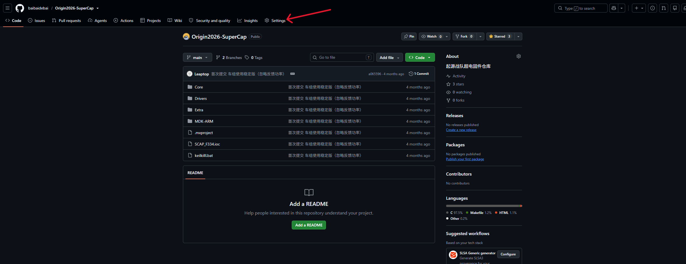
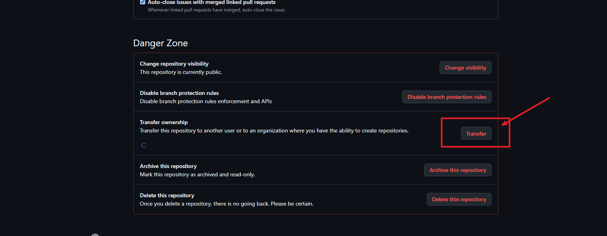
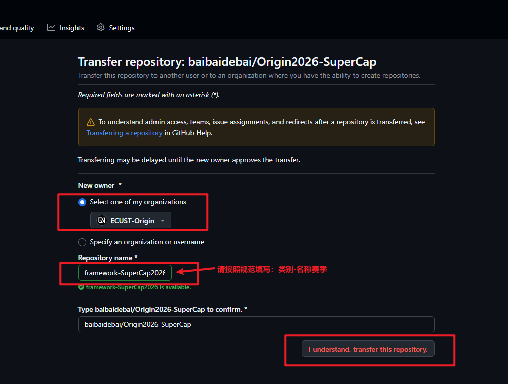
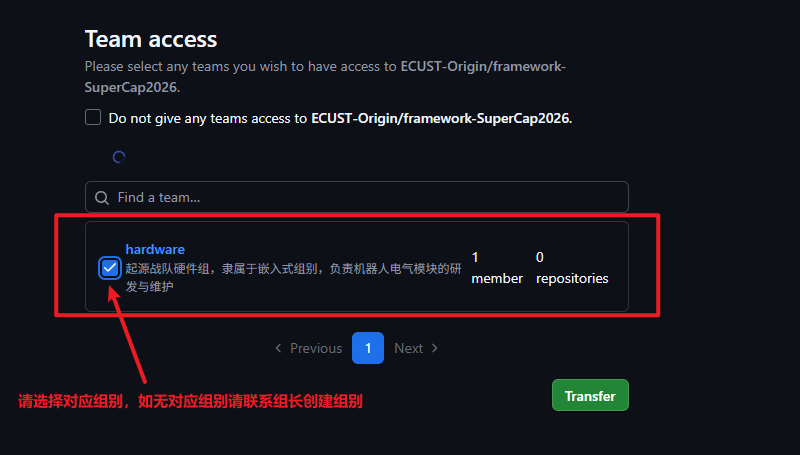
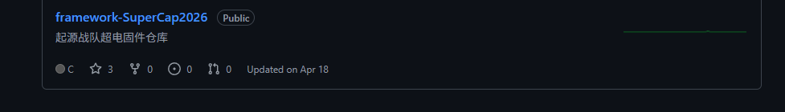

# 仓库迁移指南

> 本指南面向 **ECUST Origin 战队老队员**,用于把个人账号下的 RoboMaster 相关仓库迁移到 `ECUST-Origin` 组织,并按机器人类型重新拆分。

## 适用场景

- 你之前在自己 GitHub 账号下开发了比赛代码、训练代码、视觉/算法 demo。
- 现在需要把这些仓库交给组织统一管理,继承到对应技术组(机械/电控/硬件/视觉/导航/软件)。
- 同时要按 **机器人类型**(hero / infantry / sentry / engineering / air / dart 等)重新拆仓库。

!!! note "不适用场景"
    - 跨组织迁移(从其他战队组织迁过来):请联系队长,走单独流程
    - 私有付费仓库:本组织使用公开 plan,如遇额度问题联系队长
    - **本指南不适用**于普通贡献 / 日常 push,那只需要看 [贡献指南](https://github.com/ECUST-Origin/docs/blob/main/CONTRIBUTING.md)

## 第 0 步:确认你在这 6 个 team 之一

迁移前先确认你属于哪个 team。仓库归口 team,后续 review、权限分配、CI 资源都按 team 走。

| Team slug | 负责 | 仓库命名 |
| --- | --- | --- |
| `mechanical` | 机械设计 | `mech-<repo202x>` |
| `embedded` | 电控 / 嵌入式代码 | `embedded-<repo202x>` |
| `hardware` | PCB / 固件 | `hardware-fw/pcb-<repo202x>` |
| `vision` | 视觉 / 自瞄 | `vision-<repo202x>` |
| `navigation` | 定位 / 路径规划 | `navigation-<repo202x>` |
| `software` | 客户端 / 工具 | `software-<repo202x>` |

!!! tip "我不确定归哪个 team?"
    问自己:这个仓库最终主要被谁编译、谁 review、谁长期维护?那就是 ta 的 team。
    跨 team 项目(比如视觉 + 嵌入式联调)以"主负责 team"归口,另外的 team 拉 collaborator。

---

## 第 1 步:加入组织与对应 Team

### 1.1 加入 ECUST-Origin

1. 打开 https://github.com/orgs/ECUST-Origin/people
2. 如果你没在组织里,会看到 "Join this organization" 按钮,点它
3. 等组织 owner 批准(一般一两天内)

如果你已经是组织成员,跳过这步。

### 1.2 加入对应技术组 Team

1. 打开 https://github.com/orgs/ECUST-Origin/teams
2. 找到你的 team(`mechanical` / `embedded` / `hardware` / `vision` / `navigation` / `software` 之一)
3. 点 team 页面 → "Members" → 联系 team maintainer 把你加进去

!!! warning "team 还没建?"
    找队长开 team,然后再继续。

### 1.3 开启 2FA(必须)

GitHub 要求所有仓库 owner 开启 2FA,否则转让按钮是灰的。

设置路径: https://github.com/settings/security → "Two-factor authentication" → Enable。

推荐用 Authenticator App(1Password / Google Authenticator / Microsoft Authenticator),不要用短信。

### 1.4 确认你的 PAT 权限(可选)

如果你用 `gh` CLI 操作,需要 PAT。生成路径:
https://github.com/settings/tokens?type=beta

勾选: `repo` 全部 + `admin:org` 全部 + `delete_repo`(批量清理旧仓库时用)。

---

## 第 2 步:迁移前的准备

### 2.1 盘点个人仓库

列出你账号下所有 RM 相关仓库:

```bash
gh repo list <你的个人账号> --limit 200 --json name,description,isPrivate \
  --jq '.[] | select(.description // "" | test("RM|robomaster|哨兵|英雄|步兵|工程|无人机|dart|sentry|hero|infantry|air"; "i")) | .name'
```

或打开 https://github.com/<你的账号>?tab=repositories&q=robomaster 手动看。

对每个仓库确认:
- [ ] 仓库名能体现"机器人类型 + 用途"
- [ ] 默认分支是 `main`
- [ ] README 存在且最新
- [ ] LICENSE 存在
- [ ] 没有未提交的本地修改
- [ ] 近期 1 个月内有提交(否则可能不值得迁)

### 2.2 决定每个仓库的新名字

按 §0 的命名规范改名。常见例子:

| 旧仓库名 | 新仓库名 | 归口 team |
| --- | --- | --- |
| `my-rm-2024-code` | `embedded-hero2026` | embedded |
| `vision-test` | `vision-infantry2026` | vision |
| `my-PCB-designs` | `hardware-fw/pcb-driver-board2026` | hardware |
| `sentry2023` | `mech-sentry2026` | mechanical |
| `my-slamexp` | `navigation-prototype2026` | navigation |
| `rm-dashboard` | `software-dashboard2026` | software |

### 2.3 把一个仓库拆成多个(可选,但推荐)

很多个人仓库里混了好几个机器人的代码。**先拆再迁**,别让组织继承混乱。

用 `git filter-repo` 按路径拆:

```bash
# 安装
pip install git-filter-repo

# 克隆裸仓库
git clone --bare https://github.com/<you>/<repo>.git old-repo.git
cd old-repo.git

# 例:把 infantry/ 目录拆出来作为新仓库
git filter-repo --path infantry/ --path-rename infantry:src
cd ..
git clone old-repo.git new-infantry-repo
cd new-infantry-repo
git remote set-url origin <待会儿 ECUST-Origin 那边的新地址>
```

类似地把其他子目录拆出来。

!!! danger "拆仓库前先备份"
    `git filter-repo` 改写历史是不可逆的。操作前先 `cp -r old-repo.git old-repo.git.bak`。

### 2.4 验证工作区干净

```bash
cd <待迁移的本地仓库>
git status          # 必须 nothing to commit
git fetch origin
git status -uno     # 不能有 ahead/behind
git tag -l | head   # 检查 tag 是否齐
```

---

## 第 3 步:转让仓库(标准流程)

### 3.1 在 GitHub 网页上发起转让
1. 打开 https://github.com/<you>/<repo>/settings

2. 滚到最底下 "Danger Zone" → "Transfer ownership"

3. **New owner**: `ECUST-Origin`
4. **New repository name**: 填 §2.2 决定的新名字
5. 确认(会要求你输入仓库名二次确认)

6. 选择对应组别

7. 等待几秒,会被重定向到新仓库页面


转让完成后,GitHub 会自动:
- 把所有 issue、PR、release、tag、wiki 一起迁过去
- 给所有 star / watch 的人发邮件
- 在原 URL 设置 301 跳转
- 把头像链接更新为组织头像

### 3.2 替换本地 remote

转让后旧的 remote URL 失效(会 404):

```bash
# 1. 把 origin 改到新地址
git remote set-url origin https://github.com/ECUST-Origin/<new-repo-name>.git

# 2. 拉取新元数据
git fetch --all --prune

# 3. 验证
git log --oneline -5          # 历史应该完整
git remote -v                 # origin 应指向 ECUST-Origin
git tag -l                    # tag 应齐全
```

### 3.3 推送可能存在的本地分支

```bash
git push --all
git push --tags
```

### 3.4 验证清单

- [ ] 仓库 URL 已变为 `github.com/ECUST-Origin/<repo>`
- [ ] `git log` 历史完整、连续
- [ ] 所有 issue / PR 都在
- [ ] 所有 release / tag 都在
- [ ] star 数跟之前一致
- [ ] 原 URL 访问会 301 跳到新 URL
- [ ] Actions 能手动触发一次(如果有)
- [ ] Pages 站点能访问(如果有)
- [ ] 你的 GitHub 通知里有一条"Repository transferred"邮件

---

## 第 4 步:转让后的坑

### 4.1 Secrets 不会迁移

仓库的 Secrets 不会自动搬到组织,需要在 **组织级别** 重新配置:
https://github.com/organizations/ECUST-Origin/settings/secrets/actions

如果是仓库级别 Secrets(只这一个仓库用),就在仓库 Settings → Secrets 重新加。

### 4.2 GitHub Pages

- 转让后 Pages 站点可能短暂不可用(5-30 分钟 DNS 刷新)
- 自定义域名需要重新验证(到组织 settings/pages 处理)
- URL 从 `username.github.io/<repo>` 变成 `ECUST-Origin.github.io/<repo>`,所有引用需要更新
- Pages 自动化部署的 actions 里的 `GITHUB_TOKEN` 上下文环境变了,可能需要修

### 4.3 协作者权限清空

转让后**所有协作者会被清空**(他们对你的个人仓库有权限,但默认对组织没权限)。

```bash
# 重新把协作者加到组织
gh api -X PUT /orgs/ECUST-Origin/memberships/<username> -f role=member
```

!!! tip "转让前最好先让协作者加入组织"
    提前让协作者走 §1 流程,转让后他们直接就有仓库权限,不用再补。

### 4.4 Git LFS

LFS 配额属于账号级别。转让后**指针文件会随仓库迁移**,但 LFS 数据仍在你个人账号上。

如果个人账号 LFS 配额不够(免费 1GB),后续 `git lfs push` 会失败。

转让后验证:
```bash
git lfs fetch --all
git lfs ls-files
```

### 4.5 GitHub Apps / Webhooks

- 安装在仓库上的 GitHub Apps 不会自动转移 → 让组织 owner 重新安装
- Webhook 会迁移,但 secret 会被重置 → 在 webhook 接收端更新 secret
- Actions 里 `GITHUB_TOKEN` 的权限范围变了,可能需要重新授权

### 4.6 受保护分支 / Rulesets

- 转让后仓库继承**组织级**的 ruleset(如果有)
- 个人级的 ruleset 不会带过去
- 转让前建议在 Settings → Rules → Rulesets 截图备份

---

## 第 5 步:失败原因速查

| 报错 | 原因 | 解决 |
| --- | --- | --- |
| `A repository with this name already exists` | 组织里同名仓库 | 让 owner 重命名 / 删除旧仓库,或选个新名字 |
| `You do not have permission to transfer` | 你不是 owner | 联系当前 owner 让你先做 owner,再转让 |
| `Two-factor authentication required` | 你没开 2FA | §1.3 |
| `Organization has reached its member limit` | 成员满 | 升级 plan 或清理不活跃成员 |
| 转让按钮变灰 | 权限问题 | 确认你是组织 member,且仓库是你个人账号下的 |

---

## 附录 A:仓库命名规范

```
ECUST-Origin/
├── docs                          # 本 wiki 仓库(已存在)
├── recruitment                   # 招新资料
├── team-handbook                 # 队员手册
├── mech-<repo202x>                  # 机械
│   例: mech-hero2026 / mech-sentry2026 / mech-infantry2026
├── embedded-<repo202x>              # 电控
│   例: embedded-hero2026 / embedded-engineering2026
├── hardware-fw/pcb-<repo202x>              # 硬件
│   例: hardware-fw/pcb-driver2026 / hardware-fw/pcb-power-board2026
├── vision-<repo202x>                # 视觉
│   例: vision-infantry2026 / vision-sentry2026
├── navigation-<repo202x>            # 导航
│   例: navigation-prototype2026
├── software-<repo202x>              # 软件
│   例: software-dashboard2026 / software-recruitment-bot2026
└── experiment-<name>             # 实验性项目,3 个月不动转 archive
```

约定:
- 全部小写,`-` 分隔
- 跨 team 联调项目归主负责 team
- 退役机器人代码统一放 `ECUST-Origin-archive` 组织(不删,留作传承)

## 附录 B:统一标签体系

每个仓库同步这套标签,方便跨仓库统计与筛选。

**类型**(必须):
- `bug` / `feature` / `enhancement` / `docs` / `test` / `chore` / `refactor` / `perf`

**优先级**(建议):
- `P0`(阻塞,立即处理) / `P1`(重要,48h) / `P2`(本周) / `P3`(不急)

**状态**(建议):
- `in-progress` / `blocked` / `needs-review` / `needs-info` / `wontfix`

**子部门**(强烈建议,跟 6 个 team 对齐):
- `mech` / `embedded` / `hardware` / `vision` / `navigation` / `software`

一键同步:
```bash
# 仓库根目录放 labels.json(用附录 C 的 JSON)
gh label sync --file labels.json --repo ECUST-Origin/<repo>
```

## 附录 C:labels.json

```json
[
  {"name": "bug", "color": "d73a4a", "description": "Something isn't working"},
  {"name": "feature", "color": "a2eeef", "description": "New feature"},
  {"name": "enhancement", "color": "84b6eb", "description": "Improvement to existing feature"},
  {"name": "docs", "color": "0075ca", "description": "Documentation only"},
  {"name": "test", "color": "bfd4f2", "description": "Tests only"},
  {"name": "chore", "color": "fef2c0", "description": "Tooling / build / CI"},
  {"name": "refactor", "color": "fbca04", "description": "Code refactor"},
  {"name": "perf", "color": "f97316", "description": "Performance"},
  {"name": "P0", "color": "b60205", "description": "Critical, fix immediately"},
  {"name": "P1", "color": "d93f0b", "description": "Important, within 48h"},
  {"name": "P2", "color": "fbca04", "description": "Normal, this week"},
  {"name": "P3", "color": "0e8a16", "description": "Low priority"},
  {"name": "in-progress", "color": "ededed", "description": "Work in progress"},
  {"name": "blocked", "color": "b60205", "description": "Blocked by something"},
  {"name": "needs-review", "color": "0e8a16", "description": "Waiting for review"},
  {"name": "needs-info", "color": "d4c5f9", "description": "More information needed"},
  {"name": "wontfix", "color": "ffffff", "description": "Will not be fixed"},
  {"name": "mech", "color": "5319e7", "description": "Mechanical team"},
  {"name": "embedded", "color": "1d76db", "description": "Embedded / electronic control team"},
  {"name": "hardware", "color": "006b75", "description": "Hardware / PCB team"},
  {"name": "vision", "color": "e99695", "description": "Vision team"},
  {"name": "navigation", "color": "fbca04", "description": "Navigation / SLAM team"},
  {"name": "software", "color": "7057ff", "description": "Software / tools team"}
]
```

---

## 出问题怎么办

1. 先看 [§5 失败原因速查](#5)
2. 仍无法解决,在战队群里 @ 当前轮值的 repo captain
3. 涉及组织级别权限(token、secrets、org 限制),联系队长

!!! info "本指南的最后更新"
    {{ git_revision_date_localized }}
